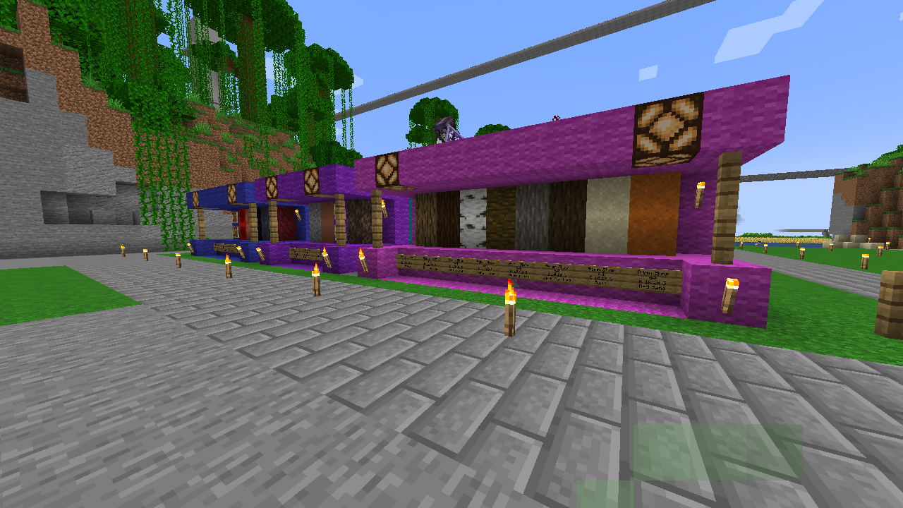
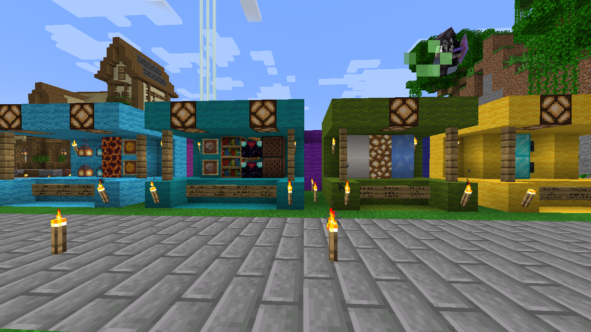
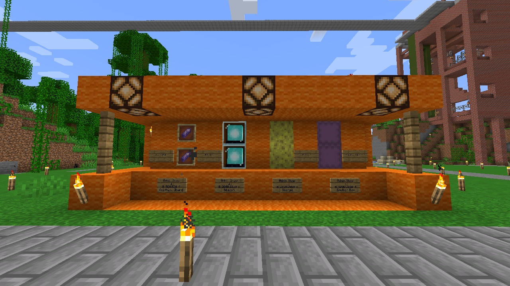
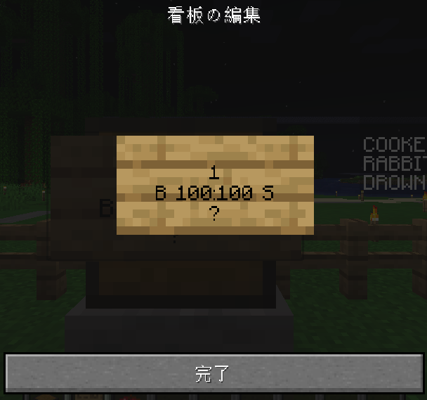
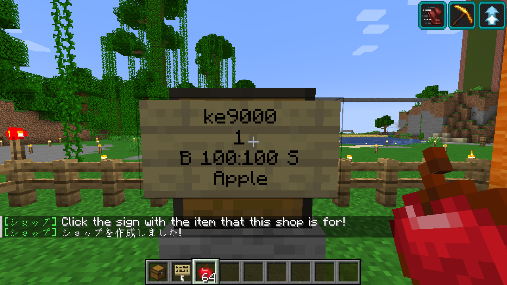

## 経済プラグインについて
- プレイヤーは最初にログインしたときに **5,000Mop(モンポ)** が貰えます。
- これを利用して、他のプレイヤーと売買したり・ショップで買い物が出来ます

### 経済プラグインで使えるコマンド
|コマンド|説明|
|:---- |:---- |
|`/money`|現在の所持Mopを確認できます |
|`/money pay {ユーザID} {渡す金額}` | 指定したユーザにMopを渡します 例:`/money pay meao0525 500`  まーくんに500Mop渡します|

## 公式ショップについて
- 公式ショップがエントランス近くにあります。  

  
  
  
  
- 在庫無制限で商品の売り買いができます。
- サーバ内の経済状況を見て、商品の入れ替えや値段の変更を行います。
- 一部取りにくい高額アイテムも扱っていますので是非見ててみてください！

## ショップについて
- チェストを使い、自分のお店を作ることができるプラグインです。
- 売り専門、買い専門、または売買両方に対応したお店を作れます。

### ショップの使い方
- チェストに貼られた看板を **右クリックすると商品を買う**
- チェストに貼られた看板を **左クリックすると商品を売る**
  - 商品が売られると自分のイベントリからアイテムが減り、所持金が増えます

### ショップの作り方
#### 必要なもの
- チェスト または トラップチェスト(RS信号を使う場合)
- 看板
- 売るアイテム
#### ステップ1: チェストの設置・看板を貼り付け
- チェストを設置したら、**スニークしながら**看板を貼り付けてください
  - そのまま右クリックすると[チェスト保護](/plugins/protect_block/) になってしまいます
#### ステップ2: 看板に必要な項目を記載する
  
- 1行目: 何も書かない
- 2行目: 1回でやり取りする個数 
  - (例:1個なら「１」, 0.5スタックなら「32」, 1スタックなら「64」)
- 3行目: 売り買いの値段
  - 販売と買い取りどちらもする場合
    - `B (売る値段):(買い取る値段) S` 
      - 例:`B 100:100 S`
  - 販売のみの場合
    - `B (売る値段)` または `(値段のみ)`
      - 例:`B 100` または `100`
  - 買い取りのみ場合
    - `S (買い取る値段)`
      - 例:`S 100`
- 4行目: `?`
  - **必ず半角で!**

- 全て書いたら「完了」
#### ステップ3: 売るアイテムの設定
- 売るアイテムを**手に持って**看板を右クリックすると`?`が英語の販売名に変わります  

#### ステップ4: チェストにアイテムを入れる
- 販売はチェストにある分だけ売ることが出来ます
- 在庫には注意しましょう！
- トラップチェストとレッドストーン回路をうまく活用すれば、在庫状況を確認できたりするかもしれません！試してみてね！
