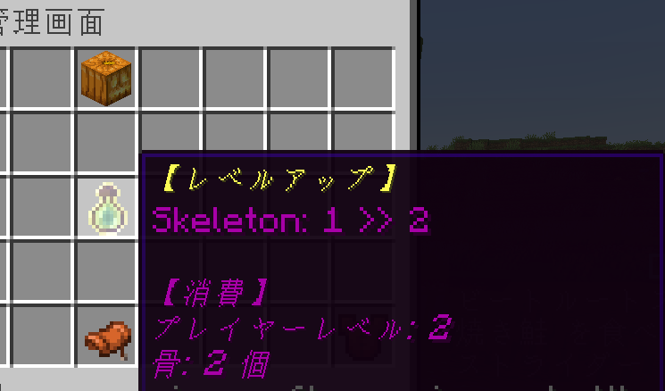

## 【仲間にする】
Mobは基本的に、「**倒す**」か「**餌をあげる**」ことで仲間にすることができます。
ここでは仲間にしたMobのことを「モンスター」と呼びます。

### 倒して仲間にする
Mobを倒すと4％の確率で、対象のMobが**捕獲可能状態**となります。

### 餌をあげて仲間にする
通常のマイクラで餌をあげることができるMob（ブタやヒツジなど）に餌をあげた場合も、稀に捕獲可能状態となります。  
また、通常のマイクラで捕まえることができるMob（オオカミやウマなど）は、普段と同様の方法で仲間にすると捕獲可能状態となります。  
※ただし、確率は通常よりも低くなっています

### 捕獲可能状態
Mobが捕獲可能状態になると、「仲間になりたそうにこちらを見ている…」とメッセージが表示され、Mobが発行状態になります。  
また、頭の上で60秒のカウントダウンが始まり、制限時間以内に対象のMobを仲間にすることができます。  
  
捕獲可能状態のMobを右クリックし、【仲間にする】を選択すると仲間に加えることができます。（**最大9体**）  
【仲間にしない】を選択した場合や、制限時間が過ぎた場合は、Mobはその場からいなくなります。   
(仲間にしない場合、[ [猛特訓](###猛特訓)/経験値/素材 ]のいずれかをドロップします)

## 【仲間にできるMob一覧】
  
仲間にできるMobと各[ステータス](###ステータス)のベース値を紹介します。  
  


## 【育てる】
捕まえたモンスターを**素手**で右クリックすると、全モンスターの選択画面が開きます。  
選択画面から対象のモンスターを選ぶとモンスターの管理画面を開くことができます。  
管理画面では、モンスターのステータスの確認やレベルを上げることができます。  

### ステータス
モンスターを捕まえると、前項に記載されたステータスのベース値をもとに、ランダムなステータスが与えられます。  
ステータスは、管理画面左上のアイコンにカーソルを合わせることで確認することができます。  
各ステータスの値は、**通常のマイクラで使用される値とは異なります**ので、ご注意ください。  
（攻撃力50だからってマイクラで50ダメージ与える訳ではないよってことです）  

#### 採掘について
所有モンスター全員の採掘の合計値が100に達すると、プレイヤーは「採掘速度上昇Ⅰ」の効果を常時得ることができます。  
その後は、100ごとに採掘速度上昇効果のレベルが上がります。  

### 特技・苦手
モンスターにはそれぞれ「**特技**」と「**苦手**」があります。  
レベルアップの際、「特技」のステータスは上昇しやすく、逆に「苦手」のステータスは上昇しにくくなります。  
※捕まえた直後の個体値には影響を与えません。

### レベルを上げる
管理画面中央のアイコンから、モンスターのレベルを上げることができます。（**最大レベル100**）  
モンスターのレベルが上がると、ランダムにステータスが上昇します。  
※特技のステータスはステータスが上昇する確率が高く、逆に苦手なステータスは上昇する確率が低いよ！  
  
各モンスターには固有の**レベルアップ素材**があり、レベルアップの際にはレベルアップ素材とプレイヤー経験値を消費します。  
消費する素材、経験値の量は、レベルアップのアイコンにカーソルを合わせることで確認することができます。  

  
## 【スリープ】
管理画面上部のカボチャアイコンから、モンスターを**スリープ状態**にすることができます。  
スリープ状態になったモンスターは、その場で動かなくなり、ダメージも受けません。  
もう一度アイコンをクリックすると、スリープを解除することができます。

## 【瀕死】
モンスターはHPが0になると「**瀕死**」状態となります。  
瀕死になったモンスターは、プレイヤーのリスポーン地点にテレポートされ動かなくなります。  
  
また瀕死になったモンスターは、アイテム「[げんきのいし](###げんきのいし)」を使用すると復活させることができます。  

## 【逃がす】
瀕死状態のモンスターを右クリックすると、逃がす画面が表示されます。  
逃がす画面中央のアイコンをクリックすると**モンスターを逃がすことができます。**  
  
一度逃がしたモンスターは元に戻すことができないのでご注意ください。  

## 【アイテム】
マイクラモンスターズで使用される独自アイテムを紹介します。
### げんきのいし

入手方法：クラフト  
  
瀕死状態のモンスターに対し、げんきのいしを手に持って右クリックすると、対象のモンスターを復活させることができます。  
「げんきのいし」は**銅インゴット4つ**と**ヒナソウ1つ**を↓のように並べることでクラフトできます。

### モンスターズスティック

入手方法：ログインボーナス  
  
手に持って一般Mobを右クリックすることで、必ず対象のMobを捕獲可能状態にすることができます。  

### 猛特訓

入手方法：捕獲可能状態のモンスターを仲間にしない  
  
「猛特訓」を手に持った状態でモンスターを右クリックすると、モンスターの特技・苦手をランダムに変更することができます。  
特技・苦手のどちらかのみを変更することはできないので、ご注意ください。 

### 特殊ネームタグ

入手方法：モンスターズパス特典

「特殊ネームタグ」を手に持った状態でモンスターを右クリックすると、モンスターの名前に色を付けることができる。
(カラーバリエーションは10色)  
既に名前に色がついているモンスターに使用した場合も、上書きされる。
色がついているモンスターに、通常のネームタグを使用した場合は、色はそのままに名前のみ変更される。

## 【シークレットモンスター】  
通常のサバイバルでは出会えないシークレットモンスターが出現することがあります。  
各シークレットモンスターをご紹介～～～！

## 巨大ファントム
ファントムを倒して捕獲可能になった場合、**10%**の確率で巨大ファントムになる。

## ゾンビホース
スケルトンホースを倒して捕獲可能になった場合、**10%**の確率でゾンビホースになる。

## 殺人ウサギ
ウサギを倒して捕獲可能になった場合、**1%**の確率で殺人ウサギになる。

## イリュージョナー
ピリジャーを倒して捕獲可能になった場合、**1%**の確率でイリュージョナーになる。
