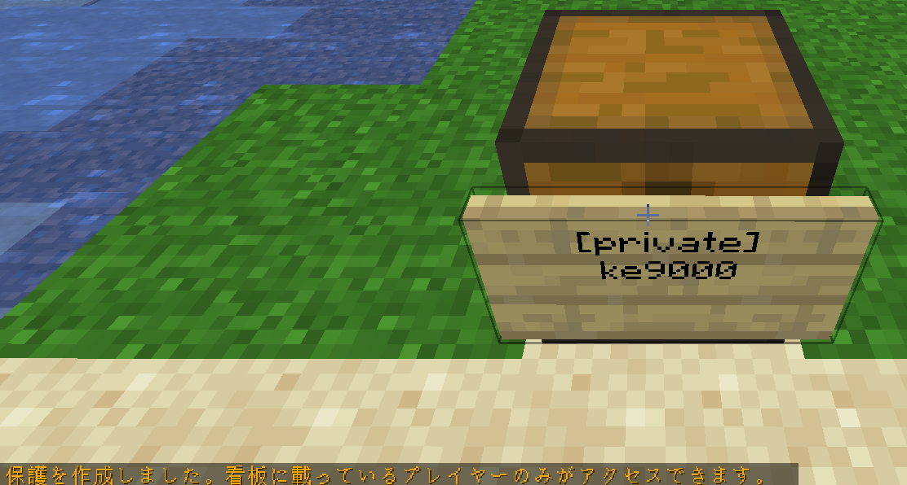
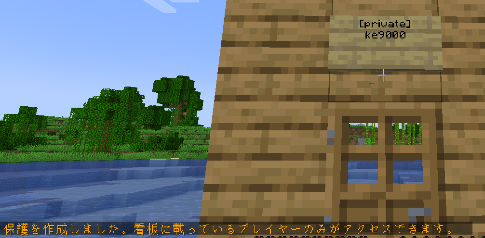
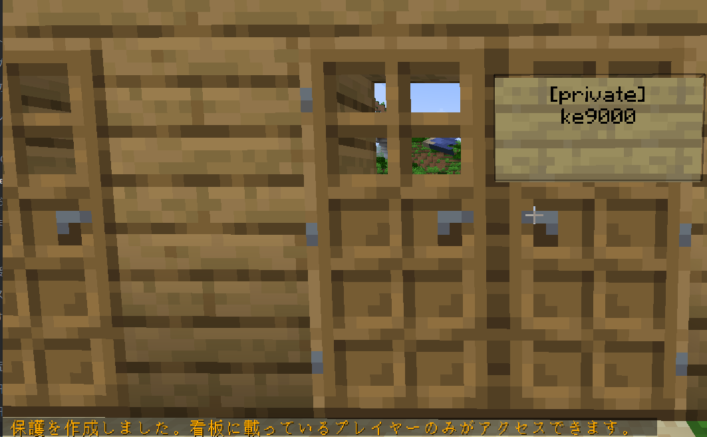
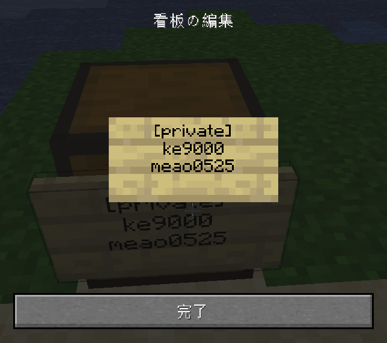
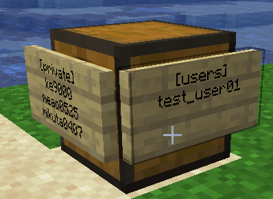
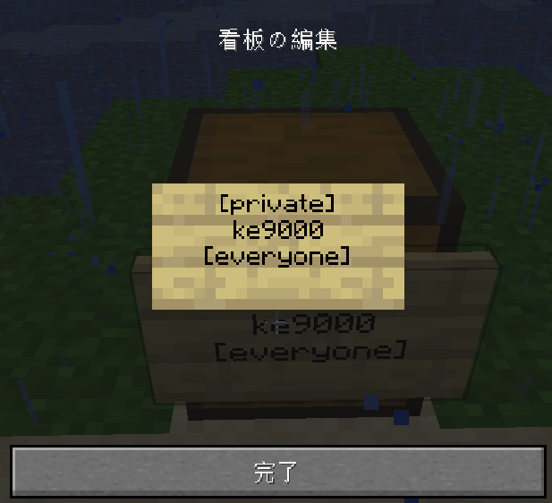

## 【概要】
ドア・チェストを保護してくれるプラグイン  
看板を取り付けることによって、ドアからの侵入やチェストからの窃盗を防ぐ事ができます。  
※ブロックの破壊は一部を除き、防げません。  
　エリアの保護が必要です。（後日記事公開予定）

## 【使い方】
### 1. 自分だけ使えるようにする
#### チェストの場合
看板を手に持ち、チェストに対して右クリックをすると自動で保護がされます。

　
#### ドアの場合
ドアの上部　または　ドア自体　に看板を付けることで自動で保護されます。

どちらでやっても効果に違いはありません。

ドアが隣接している（両開き）場合、看板を設置すると両方のドアが連動して開くようになります。

### 2.他人が利用できるようにする
#### 特定の人を追加する
看板を右クリックし、3行目に追加したい人のユーザIDを書く事で利用者を追加できます。

3人以上追加する場合は、側面（ドアの場合は横のブロックも可）に看板を右クリックで設置します。  
`[users]`以下に追加するユーザIDを記載するとその人も利用することができるようになります。  

#### 全員がアクセスできるようにする
看板を右クリックし、３行目に `[everyone]`と記載することで全員が利用することが出来ます。

## プラグイン情報
[BlockLocker | SpigotMC - High Performance Minecraft](https://www.spigotmc.org/resources/blocklocker.3268/)